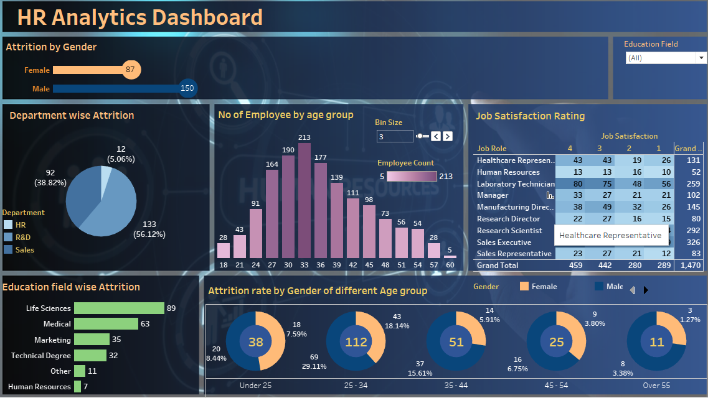

# HR Analytics – Workforce & Attrition Insights

## Overview
This project analyzes HR data to identify key drivers of employee attrition and workforce trends using data visualization and analytics.

## Tools & Skills
- Tableau (Dashboarding, Filters, Calculated Fields)
- Excel (Data Cleaning, EDA)
- HR Analytics (Attrition, Workforce Trends)
- Data Visualization & Storytelling

## Business Use Case
This dashboard helps HR leadership identify high-risk attrition segments, 
optimize retention strategies, and improve workforce planning decisions.

## Files in this project
- 📘 **Project Description:** Project_Overview.docx
- 📊 **Dashboard Screenshot:** Dashboard.png

## Key Insights
- Higher attrition observed among early-tenure employees
- Compensation and role stagnation correlate with churn
- Department-level patterns highlight retention risk areas

## Dashboard Preview

